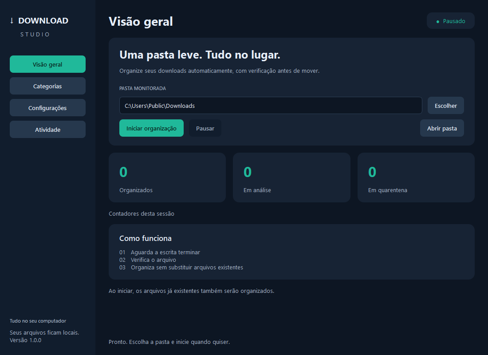
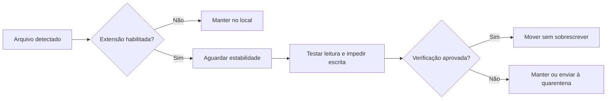

<div align="center">

# Download Studio

**Uma pasta leve. Tudo no lugar.**

Organizador de Downloads para Windows com interface gráfica, categorias configuráveis e verificação antes de mover.

[Baixar para Windows](https://github.com/marcosdilo/downloadstudio/releases/latest) · [Guia de uso](docs/GUIA.md) · [Como contribuir](CONTRIBUTING.md)

</div>



## Comece em três passos

1. Acesse [Releases](https://github.com/marcosdilo/downloadstudio/releases/latest) e baixe **DownloadStudio-Windows-x64.zip**.
2. Extraia o pacote para uma pasta fixa, fora de Downloads, e abra **DownloadStudio.exe**.
3. Confira a pasta selecionada e clique em **Iniciar organização**.

**Não é necessário instalar Python.** A primeira execução começa pausada. Ao iniciar, os arquivos já existentes na raiz da pasta também serão organizados.

O aplicativo é portátil, destinado a Windows 10/11 de 64 bits. A versão 1.0.0 foi testada no Windows 11 x64. O executável ainda não possui assinatura digital de editor.

## Recursos

- Monitoramento de criação, alteração e renomeação de arquivos com watchdog.
- Interface em português com temas escuro, claro e sistema.
- Escolha da pasta monitorada, incluindo Downloads redirecionada no Windows.
- Seis categorias com nomes e extensões editáveis; categorias podem ser desativadas.
- Verificação de estabilidade, leitura e integridade básica antes da movimentação.
- Proteção contra sobrescrita: duplicatas recebem `(1)`, `(2)` e assim por diante.
- Quarentena opcional para arquivos reprovados.
- Logs em tempo real, histórico rotativo e contadores da sessão.
- Execução em segundo plano pela bandeja do Windows.
- Preferências persistentes e opção de iniciar o monitoramento ao abrir o aplicativo.

O processamento é local. O aplicativo não envia os arquivos monitorados para servidores.

## Categorias padrão

| Pasta | Extensões |
| --- | --- |
| `Imagens` | `.png`, `.jpg`, `.jpeg`, `.gif`, `.webp`, `.svg` |
| `Documentos_PDF` | `.pdf` |
| `Planilhas_Docs` | `.xlsx`, `.xls`, `.csv`, `.docx`, `.doc`, `.txt`, `.pptx` |
| `Instaladores` | `.exe`, `.msi`, `.iso` |
| `Compactados` | `.zip`, `.rar`, `.7z`, `.tar`, `.gz` |
| `Videos_Audios` | `.mp4`, `.mkv`, `.avi`, `.mp3`, `.wav` |

Extensões desconhecidas ficam no local. As subpastas não são percorridas. Arquivos `.crdownload`, `.tmp`, `.part`, `.partial` e `.download` são ignorados.

## Como a organização funciona



O intervalo padrão é de dois segundos. O aplicativo compara tamanho e data de modificação e obtém um handle do Windows que impede escrita durante a verificação e movimentação. Arquivos em uso são tentados novamente; uma varredura a cada 30 segundos recupera eventos eventualmente perdidos.

| Formato | Verificação |
| --- | --- |
| PNG/JPG/JPEG | Pillow `Image.verify()` e decodificação dos pixels |
| ZIP | Reconhecimento estrutural com `zipfile.is_zipfile()` |
| Demais extensões | Leitura binária e tamanho maior que zero |

**Limites:** estabilidade é uma heurística e não prova que um download terminou. O teste de ZIP não confere todos os CRCs, e os demais formatos não passam por validação completa de conteúdo. A checagem não substitui antivírus nem checksum do fornecedor. Consulte [o guia](docs/GUIA.md) antes de ajustar o intervalo ou a quarentena.

## Interface e configurações

| Tela | O que você pode fazer |
| --- | --- |
| Visão geral | Selecionar pasta, iniciar/pausar, abrir a pasta e acompanhar contadores |
| Categorias | Editar pastas e extensões; habilitar ou desabilitar categorias |
| Configurações | Ajustar estabilidade, quarentena, início ao abrir, bandeja e tema |
| Atividade | Acompanhar eventos, limpar a visualização e abrir o arquivo de log |

Pause antes de editar regras. Clique em **Salvar** após a edição; **Iniciar organização** também valida e salva as preferências.

Fechar a janela mantém o aplicativo na bandeja quando essa opção está ativa. Use o menu do ícone para reabrir, iniciar/pausar ou **Sair**. Iniciar ao abrir o aplicativo é diferente de iniciar ao entrar no Windows; o [guia](docs/GUIA.md#segundo-plano) explica a configuração por atalho.

As preferências e logs ficam em `%LOCALAPPDATA%\DownloadStudio`:

```text
config.json                 Preferências
atividade.log               Histórico (5 MB, três backups)
erro-inicializacao.log      Diagnóstico de falhas de abertura
```

## Estrutura do repositório

```text
downloadstudio/
├── app-source/
│   ├── launcher.py         Entrada do executável e diagnóstico
│   ├── desktop.py          Interface Qt e bandeja
│   ├── service.py          Monitoramento em thread independente
│   ├── core.py             Validação e movimentação no Windows
│   ├── settings.py         Validação e persistência de preferências
│   ├── test_app.py         Testes de integração
│   ├── build.py            Compilação com PyInstaller
│   └── requirements.txt    Versões das dependências
├── docs/                   Guia, arquitetura e imagem da interface
├── licenses/               Licenças dos componentes distribuídos
├── CHANGELOG.md            Histórico de versões
├── CONTRIBUTING.md         Orientações para contribuição
└── TERCEIROS.md             Componentes e direitos de uso
```

Os binários são distribuídos em **Releases**. Não fazem parte do histórico do código.

## Executar a partir do código

Requisitos para desenvolvimento: **Windows x64 e Python 3.12**. Use um caminho curto para evitar limites de comprimento de caminhos no Windows.

```powershell
git clone https://github.com/marcosdilo/downloadstudio.git
cd downloadstudio\app-source
py -3.12 -m venv .venv
.\.venv\Scripts\python.exe -m pip install -r requirements.txt
.\.venv\Scripts\python.exe launcher.py
```

Para testar com dados separados das suas preferências habituais:

```powershell
.\.venv\Scripts\python.exe launcher.py --data-dir C:\temp\downloadstudio-dev
```

Escolha uma pasta de testes na interface antes de iniciar a organização.

## Testes

Na pasta `app-source`:

```powershell
.\.venv\Scripts\python.exe test_app.py
```

Os testes usam pastas temporárias e o observador real do Windows. Cobrem renomeação de temporários, duplicatas, imagens/ZIP, arquivos bloqueados ou reprovados, quarentena, categorias personalizadas/desativadas, pausa e persistência das configurações.

A versão inicial também passou por teste da interface (navegação, temas, salvar, iniciar, organizar, contadores e pausar) e teste de abertura das quatro telas do executável empacotado.

## Gerar o executável

```powershell
.\.venv\Scripts\python.exe build.py
```

O resultado é `DownloadStudio.exe` na raiz do repositório. A compilação inclui Python e as bibliotecas necessárias, e isola o `PATH` para não incorporar DLLs de outros programas. Consulte [a arquitetura](docs/ARQUITETURA.md) para detalhes dos módulos.

## Contribuições e uso

Sugestões e problemas podem ser enviados em [Issues](https://github.com/marcosdilo/downloadstudio/issues). Leia [CONTRIBUTING.md](CONTRIBUTING.md) e remova nomes de arquivos ou caminhos pessoais dos logs antes de compartilhá-los.

As condições de uso do código do aplicativo e as licenças independentes de Qt/PySide6, Python, Pillow, watchdog e PyInstaller estão descritas em [TERCEIROS.md](TERCEIROS.md) e na pasta [licenses](licenses).
